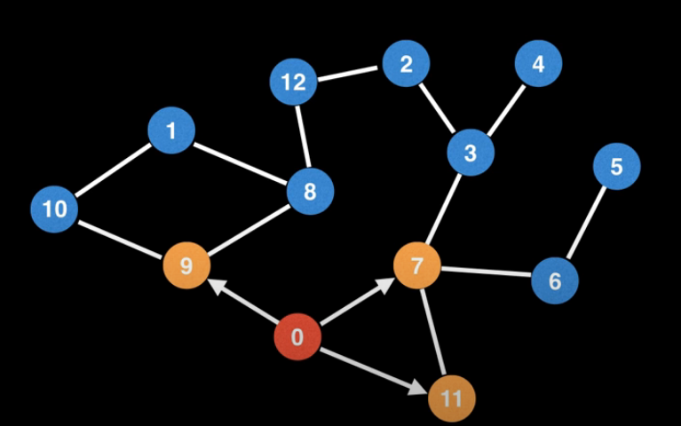
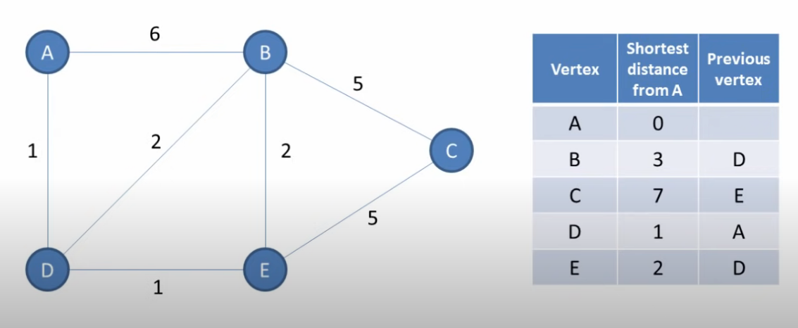
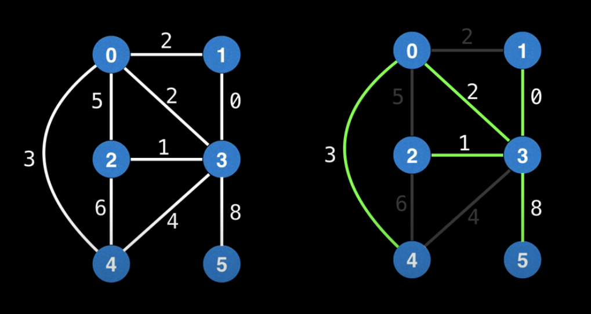
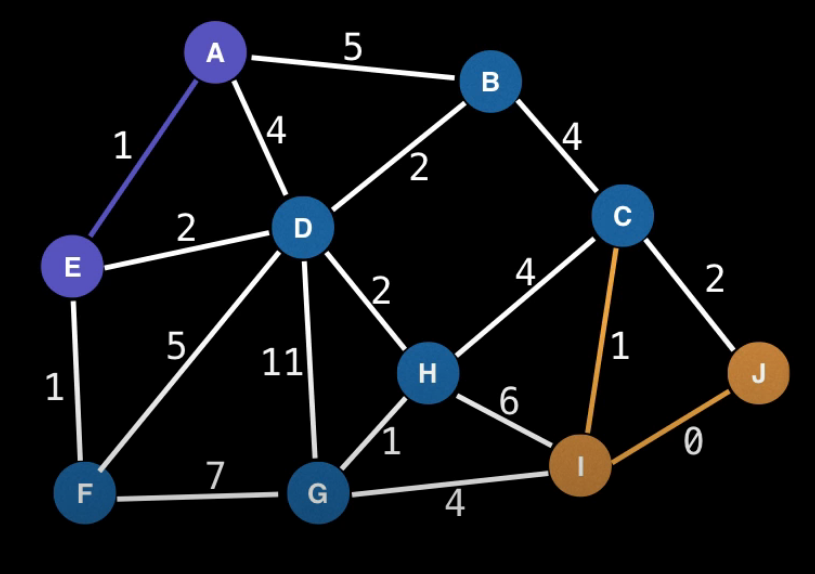
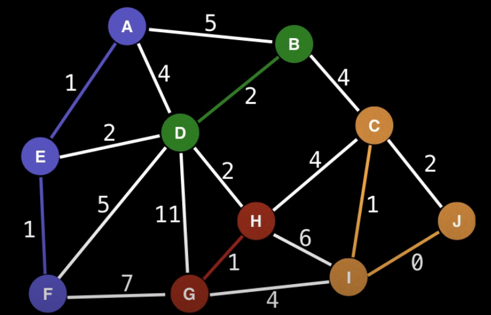
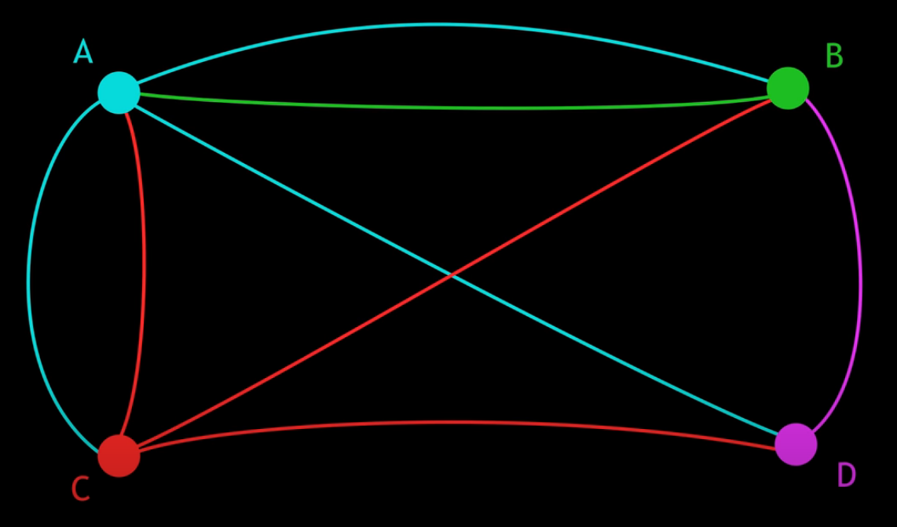

# Graph Algorithms
# Name: Abhay Patil
# Roll: 2020101022

## What is an algorithm?
In the most general sense, an algorithm is a series of instructions that tells the computer how to transform
some data in the world to useful information. For example, Insertion sort is an algorithm that tells a computer
how to convert data(a list of unsorted numbers) to information(a list of sorted numbers).

## How do we compare algorithms?
In the real world, we find that there are many cases where we cannot say that a specific algorithm is better
or worse than the other. It may be that one algorithm works better for certain kinds of inputs, but worse
for another kinds. For example, consider Insertion sort and Quick sort. Many would consider Quick sort to be
the superior algorithm and they would be right, because the average time complexity for it is O(nlogn) while
for Insertino sort it is O(n2). However, consider a situation where we already had a sorted array and due to
some memory corruption or human errors, some of the numbers were mmisplaced. If we know that most of the array
is sorted, we would prefer Insertion sort O(n) to Quick sort O(nlogn). Here, the array being mostly sorted
is taken advantage of by Insertion sort, but makes no difference to Quick sort.

Hence we must carefully analyze the problem at hand before deciding our algorithm. Aside from this, the most
objective methods of analyzing efficiency of algorithms are its Time Complexity and Space Complexity.
Typically we place more value on time complexity than space complexity, because time is more scarce than memory.

### Time Complexity
Time complexity is a measure of the amount of computer time is required to run an algorithm. We typically
estimate this by counting the number of elementary operations performed by an algorithm. One may consider
the worst case time complexity, average case time complexity and in some rare cases, the best case time
complexity to judge an algorithm's efficiency. The worst case is considered when the algorithm is crucial
to the working of a system, and failiure to execute within a certain time frame is not an option.

The most common representation of time complexitry is the Big O notation. In this, the number of elementary
operations (which will be proportional to the time) is measured as a factor of the input size n.
So if the time taken varies linearly with n, its complexity is O(n).
Constant time operations are not accounted for, as they are negligible. So O(n + K) is the same as O(n).

The best case is seldom used because the chances of it happening are slim, although an example of it being
used is already mentioned in the Insertion sort vs Quick sort analysis. Consider Bogo sort. It is an
algorithm literally designed to be slow. It computes random permutations of an unsorted list in the hope
that it will eventually end up with a sorted one. It's best case is O(n), that is when the first permutation
itself is sorted. Unlike Insertion sort however, the chances of this happening is practically 0, specifically 1/n!.

### Space Complexity
Space complexity of an algorithm describes the amount of memory required for an algoerithm to run. 
Here the memory required to store the input is not considered. We only care about the additional
memory needed.

O(1) space complexity means that the algorithm only requires constant additional memory.
O(n) space complexity means that the algorithm requires Kn space, where n is the input size.`

## Algorithm Paradigms
Algorithm paradigm is a generic framework which underlines the design of a class of algorithms.
Examples are as follows:
- Backtracking
- Brute-Force
- Divide and Conquer
- Dynamic Programming
- Greedy Algorithm
- Prune and Search

### Divide and Conquer (DAC)
This technique can be divided into 3 parts:
- Divide : This involves dividing the problem into smaller sub-problems
- Conquer: Solve the sub-problems recursively
- Combine: Combine the sub-problems to get the final solution of the main problem

Examples of DAC algorithms:
- Quicksort
- Merge Sort
- Karatsuba Algorithm (Fast multiplication)
- Strassen's Algorithm (Matrix multiplication)

### Greedy Algorithm
Greedy algorithms takes all of the data in a particular problem, and then sets a rule that decides which elements
need to be added to the solution at each step of the algorithm.

Greedy algorithms cannot be used everywhere. Consider the following problem.
We are required to find the algorithm with the largest sum. The greedy algorithm fails, because it makes
decisions based on the information it has at any one single step, without regard for the overall problem.
Herethe algorithm choses 12 because it is larger than 7. It has no way of knowing that the left branch
still has a higher sum overall. The choice made by a greedy algorithm may be influenced by the choices made
so far, but it cannot be aware of future choices it may make, and this is where it sometimes falls short.


For a greedy algorithm to work, it must satisfy the following two properties:
- `Greedy choice property`: An overall optimal solution can be reached by selecting the optimal solution at each step.
- `Optimal substructure`  : An optimal solution to the entire problem contains the optimal solutions to the sub-problems.

Examples of Greedy algorithms:
- Dijkstra's Algorithm (Find shortest path)
- Huffman Coding (Compress data)

### Dynamic Progamming
Dynamic programming is tightly tied to recursive algorithms. Whenever we see a recursive algorithm that has
multiple calls for the same inputs, we can optimize it with dynamic programming. All we have to do is store
the results of the subproblems, so that we don't have to recompute them when needed later on.

This optimization trick reduces time complexity from exponential to polynomial. For example, the time complexity
for the recursive algorithm for finding the n<sup>th</sup> fibonacci number is exponential, whereas with
dynamic programming, it is linear.

Examples of dynamic programming:
- nth Fibonacci number
- Partitioning sets
- Binomial coefficient
- Longest repeated subsequence
- Shortest path

## Graph Algorithms

### Depth First Search (DFS)
This is an algorithm to traverse a graph. It is the most fundamental algorithm used to explore nodes and edges
of a graph. On it's own, DFS isn't all that useful. However, when augmented to perform other tasks such as
count connected components, determine connectivity, find bridges etc is when DFS really shines.

A DFS plunges depth first into a graph, chosing any edge at random until it cannot go further, at which point
it backtracks and continues.


- In this case, the source is node 0. From here we can go to node 0 or node 9. We arbitrarily select node 9
and proceed.
- This happens until we reach node 11 from where we cannot go to any unvisited nodes. At this point, we
backtrack all the way to node 7.
- Now, we select an unvisited node and the process continues.
- We finish when we have backtracked back to the source ie node 0.

**Algorithm**

```java
    // Global Variables
    n = number of nodes in the graph
    g = adjacency list representing graph
    S = source node
    visited = [false, ..., false]   // V

    function dfs(node):
        if visited[node]: return
        visited[node] = true

        neighbours = g[node]
        for i in neighbours:
            dfs(i)

    dfs(S)  
```
---
**Backtracking in DFS**  
The DFS algorithm uses an algorithm paradigm known as `backtracking`. Backtracking is a general algorithm for finding
solutions to computational problems that incrementally builds candidates to the solutions, and abandons a candidate
(backtracking) as soon as it determines that the candidate cannot possibly be completed to a valid solution.
In our case, the backtracking happens when we come across a node that has no unvisited neighbours and hence we have
nowhere to go. At this point, we backtrack until we reach a node that has atleast one unvisited neighbour.

**Time Complexity**  
In the line `visited = [false, ..., false]`, we are initializing V nodes to false. So this is an O(V) operation.

Note that `visited[node] = true` is a constant time operation that is executed for each vertex in the graph exactly
once. So the total time complexity for this line will be O(V).

For a node with e edges, the for loop will execute e times. Let n(Ai) denote the number of edges of node Ai.
The total time complexity for this loop will be n(A<sub>1</sub>) + n(A<sub>2</sub>) + ... + n(A<sub>V</sub>) = 2E.

Thus we have O(2V + 2E) = O(V + E)
### Breadth First Search (BFS)
The Breadth First Search is another fundamental search algorithm used to explore nodes and edges of a graph. It runs with the same time complexity as DFS and is often used as a building block for algorithms. The BFS algorithm is particularly used for one thing: finding the shortest path on unweighted graphs.

A BFS starts at some source node, and explores the neighbouring nodes first, before moving to the next level of neighbours. It does this by maintaining a queue of which nodes to visit next.

Consider the following graph:



- Let's begin the BFS at node 0.
- Add 0 to the queue. Q = [0]
- Explore all of 0's unvisited neighbours (9, 7 and 11) and add them to the queue. Q = [0, 9, 7, 11]
- 9 is next up in the queue, so visit 9. Add 9's unvisited neighbours (10 and 8) to the queue. Q = [0, 9, 7, 11, 10, 8]
- Next we visit 7, and the process continues until all nodes are visited.

**Algorithm**
```java
    n = Number of Nodes in the Graph
    g = Adjacency List representing Unweighted Graph
    s = Source Node
    Q = Queue
    visited = [false, ..., false]

    function bfs(node):
        if visited[node]: return
        visited[node] = true

        neighbours = g[node]
        for i in neighbours:
            Q.enqueue(i)

        bfs(Q.next())               // next() returns the first unvisited node in Q

```

**Time Complexity**
O(V + E)

### Dijkstra's Algorithm
Dijkstra's Shortest Path Algorithm finds the shortest path between any two vertices in a graph. It's applications
are clear when we use graphs to simulate roads of a city, a computer network, a social network etc. It not only
finds the shortest distance between any two vertices, but also the shortest path between them.

Consider the below graph:


- Initially, we set the distances from node A to all other nodes to infinity(in reality, this could just be a very
high number). The distance from node A to A itself is set to 0.
- The distance from A to B is 0 + 6 = 6 and the distance from A to D is 0 + 1 = 1.
- If the calculated distance to a node is less than the known distance, we update the shortest distance in our table
- In this case, the known distances to B and D are infinity, so we update the shortest distance for both of these
nodes to 6 and 1 respectively.
- The previous vertex column for both B and D is set to A, since we visted these nodes via A.
- Now that we are done updating the columns of A's neighbours, we mark A as visited.
- We now visit D since it is closer to B (1 < 6).
- Repeat this process until all nodes are visited. At this point our table is complete.
- The shortest path from A to any node can be derived from the previous vertex column.
- For example, we get to C via E, E via D and D via A, so the path is A->D->E->C.

**Algorithm**
```java
    // Setup
    D[start] = 0
    D[all other vertices] = Infinity

    while(vertices remain unvisited)
        Vist unvisited vertex closest to current vertex C
        for each unvisited neighbour N of C
            if(dist(start, N) < D[N])
                Update shortest distance to this vertex
                Update the previous vertex with C
            end if
        end for
        Add the current vertex to the list of visited vertices
    end while
```

**Dynamic Programming in Dijkstra's Algorithm**  
Note that Dijkstra's algorithm uses the existing distance(say from node A to D) to calculate the distance for another node
(from D to E). The distance from A to D does not have to be recalculated to find the distance from A to E. Hence,
Dijkstra's Shortest Path Algorithm is an example of Dynamic Programming.

**Time Complexity**
Using min-heaps, the time complexity for this algorithm is O(E + VlogV)

### Prim's Minimum Spanning Tree (MST) Algorithm
Given an undirected graph with weighted edges, a minimum spanning tree(MST) is a subset of the edges of the graph which
connects all vertices together while minimizing the total edge cost.

An MST may not be unique. It is possible for a certain undirected graph to have multiple MST's with the same minimum cost.



In the above picture, if we replace the edge (0, 3) with (0, 1) we still have an MST with cost = 14

A non-connected graph cannot have an MST, since there is no way for us to have an MST that spans multiple connected components.
Prim's MST Algorithm must therefore be run on each connected component individually.

**Prim's Algorithm**
- Maintain a priority queue(PQ) that sorts edges based on minimum cost.
- The PQ is used to determine which edge to go to next, and the edge used to do so.
- Start the algorithm on any node S.
- Mark S as visited and add all the edges of S to the PQ.
- While the PQ is not empty and the MST has not been formed, dequeue the next cheapest edge from the PQ.
- If the dequed edge is outdated(the node it points to has alread been visited), then skip it and poll again.
- Otherwise mark the selected node as visited, and add this edge to the MST.
- Repeat the same process from this node.
- We stop when the number of edges in the MST is one less than the number of nodes in the graph, as this is
what defines a tree.
- The cost of the MST is the sum of the cost of all the edges in the MST.

**Pseudocode**
```java
    V = Number of Vertices in G 
    pq = Priority Queue

    function lazyPrims()
        n = V - 1                       // Number of edges in MST
        mstEdges = [null, ..., null]    //  size n
        edgeCount, mstCost = 0, 0
        addEdges(s)

        while(!pq.isEmpty() and edgeCount != n)
            edge = pq.dequeue()
            nodeIndex = edge.to         // Note pointed to by the edge

            if visited[nodeIndex]
                continue
            
            mstEdge[edgeCount++] = edge
            mstCost += edge.Cost

            addEdges(nodeIndex)

        if edgeCount != n
            return (null, null)         // No MST exists

        return (mstCost, mstEdges)
```
        

**Prim's Algorithm as a Greedy ALgorithm**
Recall that greedy algorithms pick at each step, the most optimal choice. They work if the local optimal choice
is part of the global optimal solution. Prim's algorithm does exactly this. At each step, we pick the edge with
minimum cost and finally end up with an MST.

**Time Complexity**
The time complexity is O((V + E)logV) because each vertex is inserted in the PQ only once and
insertion into the PQ takes logarithmic time.

The time complexity can be improved to O(E + logV) using Fibonacci Heaps.

### Kruskal's Minimum Spanning Tree (MST) Algorithm
- Sort the edges in ascending order of their weight.
- Walk through the sorted edges and look at the two nodes that the edge belongs to.
- If the edges are already unified, we move on. If not, we include this edge and unify the nodes.
- The algorithm ends when every edge has been processed or all the vertices have been unified.



The first few edges in sorted order along with their cost are IJ(0), AE(1), CI(1), EF(1), HG(1), BD(2), CJ(2), ED(2).

- Start with IJ. We unify these nodes by coloring them both orange.
- Then we have AE, we color these nodes purple.
- For CI, we note that node I is already part of a group, so we color J orange to match with the group that I is a part of.
- EF will be colored purple.
- HG will be colored red.
- DB will be colored green.



- Now we have CJ. Note that C and J belong to the same group. So we do not add this edge to prevent cycles.
- For ED, we merge the groups, so B and D are colored purple.
- This process goes on until all the nodes belong to the same group.

**Pseudocode**
```java
    F: We Will Built Our MST In F
    findSet: Returns A Set Of All Nodes In The Same Group
    union: Union Of Two Sets
    makeSet: Makes A Singleton Set Containing Given Node

    function Kruskal(G):
        F = ∅

        // Make a singleton set for each node
        for each v ∈ G.V do
            makeSet(v)

        for each (u, v) in G.E ordered by weight(u, v) increasing:
            // Avoid cycles
            if findSet(u) = findSet(v):
                continue

            // Merge sets
            F = F ∪ {(u, v)} ∪ {(v, u)}
            union(findSet(u), findSet(v))
        return F
```

## Applications of Graph Algorithms

### Solving A Crime
Let us first consider a simple scenario, and worry about a  more real life situation later.
Say we have 3 suspects Alice(A), Bob(B) and Charlie(C). These are the statements made by them.
A - I'm not the thief
B - A is the thief
C - I'm not the thief

Assume we know that only 1 person is telling the truth
Our job is to work out who the thief is.
Suppose A was the thief, then B would be telling the truth, but so would C. So two people appear to be telling the truth, when it should only be 1, so A is not the thief.
Suppose B was the thief, then A and C would both be telling the truth, so B can't be the thief.
Suppose C was the thief, then A would be the only person telling the truth. Hence, only C can be the thief.

This is a more straightforward way of looking at the problem. The problem is that it is difficult to extend this method to when there are many people. In fact, even a case with 4 people would be tedious. So we must look for a more mathematical approach. This is where graphs come into the picture.

Constructing the graph:
- Represent each suspect as a node in a graph.
- B accusing A can be represnted by adding a directed edge from B to A.
- C claims that he is not the thief. This is equivalent to accusing A and B, so we represent this by adding directed edges from C to A and C to B.
- Similarly, add directed edges from A to B and A to C.

Using the graph:
- If A is the thief, ignore all the lines coming out of A. B accuses A and C accuses both B and A. So both B and C have a line going into A. Each line represents a true statement (accusing A when A is indeed the thief) and there are 2 such lines when there should only be 1, so A is innocent.
- Similarly for B, we see that there are 2 lines going into B, meaning B is innocent.
- For C, there is only one line ie from A to C, so only C can be the thief.

This graphical method is programmable and hence will work with many suspects.
Consider another suspect D who accuses B. So the statements would like as below:
A - I'm not the thief
B - A is the thief
C - I'm not the thief
D - B is the thief

This is what the graph would look like:


Analyzing the graph in the same fashion, we arrive at the following result:
| Thief | Number of people telling the truth |
|  ---  | --- |
|   A   |  2  |
|   B   |  3  |
|   C   |  1  |
|   D   |  2  |

In real life, we may not know the exact number of people telling the truth, but consider this situation. A group of 5 friends go on a camping trip and only 4 of them return. These 4 friends are interviewed individually. They are unlikely to lie, because if they do, their story will not be concurrent with the stories of the others. So we can deduce that B is more likely to be the killer than C, since 1 person lying is more likely than 3 people lying.

