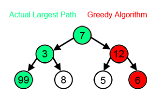
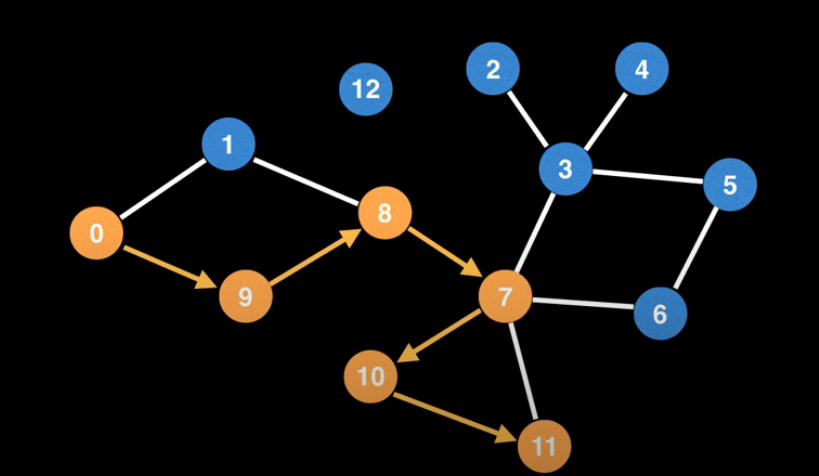

# Graph Algorithms
# Name: Abhay Patil
# Roll: 2020101022

## What is an algorithm?
In the most general sense, an algorithm is a series of instructions that tells the computer how to transform
some data in the world to useful information. For example, Insertion sort is an algorithm that tells a computer
how to convert data(a list of unsorted numbers) to information(a list of sorted numbers).

## How do we compare algorithms?
In the real world, we find that there are many cases where we cannot say that a specific algorithm is better
or worse than the other. It may be that one algorithm works better for certain kinds of inputs, but worse
for another kinds. For example, consider Insertion sort and Quick sort. Many would consider Quick sort to be
the superior algorithm and they would be right, because the average time complexity for it is O(nlogn) while
for Insertino sort it is O(n2). However, consider a situation where we already had a sorted array and due to
some memory corruption or human errors, some of the numbers were mmisplaced. If we know that most of the array
is sorted, we would prefer Insertion sort O(n) to Quick sort O(nlogn). Here, the array being mostly sorted
is taken advantage of by Insertion sort, but makes no difference to Quick sort.

Hence we must carefully analyze the problem at hand before deciding our algorithm. Aside from this, the most
objective methods of analyzing efficiency of algorithms are its Time Complexity and Space Complexity.
Typically we place more value on time complexity than space complexity, because time is more scarce than memory.

### Time Complexity
Time complexity is a measure of the amount of computer time is required to run an algorithm. We typically
estimate this by counting the number of elementary operations performed by an algorithm. One may consider
the worst case time complexity, average case time complexity and in some rare cases, the best case time
complexity to judge an algorithm's efficiency. The worst case is considered when the algorithm is crucial
to the working of a system, and failiure to execute within a certain time frame is not an option.

The most common representation of time complexitry is the Big O notation. In this, the number of elementary
operations (which will be proportional to the time) is measured as a factor of the input size n.
So if the time taken varies linearly with n, its complexity is O(n).
Constant time operations are not accounted for, as they are negligible. So O(n + K) is the same as O(n).

The best case is seldom used because the chances of it happening are slim, although an example of it being
used is already mentioned in the Insertion sort vs Quick sort analysis. Consider Bogo sort. It is an
algorithm literally designed to be slow. It computes random permutations of an unsorted list in the hope
that it will eventually end up with a sorted one. It's best case is O(n), that is when the first permutation
itself is sorted. Unlike Insertion sort however, the chances of this happening is practically 0, specifically 1/n!.

### Space Complexity
Space complexity of an algorithm describes the amount of memory required for an algoerithm to run. 
Here the memory required to store the input is not considered. We only care about the additional
memory needed.

O(1) space complexity means that the algorithm only requires constant additional memory.
O(n) space complexity means that the algorithm requires Kn space, where n is the input size.`

## Algorithm Paradigms
Algorithm paradigm is a generic framework which underlines the design of a class of algorithms.
Examples are as follows:
- Backtracking
- Brute-Force
- Divide and Conquer
- Dynamic Programming
- Greedy Algorithm
- Prune and Search

### Divide and Conquer (DAC)
This technique can be divided into 3 parts:
- Divide : This involves dividing the problem into smaller sub-problems
- Conquer: Solve the sub-problems recursively
- Combine: Combine the sub-problems to get the final solution of the main problem

Examples of DAC algorithms:
- Quicksort
- Merge Sort
- Karatsuba Algorithm (Fast multiplication)
- Strassen's Algorithm (Matrix multiplication)

### Greedy Algorithm
Greedy algorithms takes all of the data in a particular problem, and then sets a rule that decides which elements
need to be added to the solution at each step of the algorithm.

Greedy algorithms cannot be used everywhere. Consider the following problem.
We are required to find the algorithm with the largest sum. The greedy algorithm fails, because it makes
decisions based on the information it has at any one single step, without regard for the overall problem.
Herethe algorithm choses 12 because it is larger than 7. It has no way of knowing that the left branch
still has a higher sum overall. The choice made by a greedy algorithm may be influenced by the choices made
so far, but it cannot be aware of future choices it may make, and this is where it sometimes falls short.



For a greedy algorithm to work, it must satisfy the following two properties:
- `Greedy choice property`: An overall optimal solution can be reached by selecting the optimal solution at each step.
- `Optimal substructure`  : An optimal solution to the entire problem contains the optimal solutions to the sub-problems.

Examples of Greedy algorithms:
- Dijkstra's Algorithm (Find shortest path)
- Huffman Coding (Compress data)

### Dynamic Progamming
Dynamic programming is tightly tied to recursive algorithms. Whenever we see a recursive algorithm that has
multiple calls for the same inputs, we can optimize it with dynamic programming. All we have to do is store
the results of the subproblems, so that we don't have to recompute them when needed later on.

This optimization trick reduces time complexity from exponential to polynomial. For example, the time complexity
for the recursive algorithm for finding the n<sup>th</sup> fibonacci number is exponential, whereas with
dynamic programming, it is linear.

Examples of dynamic programming:
- nth Fibonacci number
- Partitioning sets
- Binomial coefficient
- Longest repeated subsequence
- Shortest path

## Graph Algorithms

### Depth First Search (DFS)
This is an algorithm to traverse a graph. It is the most fundamental algorithm used to explore nodes and edges
of a graph. On it's own, DFS isn't all that useful. However, when augmented to perform other tasks such as
count connected components, determine connectivity, find bridges etc is when DFS really shines.

A DFS plunges depth first into a graph, chosing any edge at random until it cannot go further, at which point
it backtracks and continues.



- In this case, the source is node 0. From here we can go to node 0 or node 9. We arbitrarily select node 9
and proceed.
- This happens until we reach node 11 from where we cannot go to any unvisited nodes. At this point, we
backtrack all the way to node 7.
- Now, we select an unvisited node and the process continues.
- We finish when we have backtracked back to the source ie node 0.

Pseudocode:

```java
    // Global Variables
    n = number of nodes in the graph
    g = adjacency list representing graph
    S = source node
    visited = [false, ..., false]   // V

    function dfs(node):
        if visited[node]: return
        visited[node] = true

        neighbours = graph[node]
        for i in neighbours:
            dfs(i)

    dfs(S)  
```
---
**Backtracking in DFS**  
The DFS algorithm uses an algorithm paradigm known as `backtracking`. Backtracking is a general algorithm for finding
solutions to computational problems that incrementally builds candidates to the solutions, and abandons a candidate
(backtracking) as soon as it determines that the candidate cannot possibly be completed to a valid solution.
In our case, the backtracking happens when we come across a node that has no unvisited neighbours and hence we have
nowhere to go. At this point, we backtrack until we reach a node that has atleast one unvisited neighbour.

**Time Complexity**  
In the line `visited = [false, ..., false]`, we are initializing V nodes to false. So this is an O(V) operation.

Note that `visited[node] = true` is a constant time operation that is executed for each vertex in the graph exactly
once. So the total time complexity for this line will be O(V).

For a node with e edges, the for loop will execute e times. Let n(Ai) denote the number of edges of node Ai.
The total time complexity for this loop will be n(A<sub>1</sub>) + n(A<sub>2</sub>) + ... + n(A<sub>V</sub>) = 2E.

Thus we have O(2V + 2E) = O(V + E)

### BFS
### MST

## Applications of Graph Algorithms